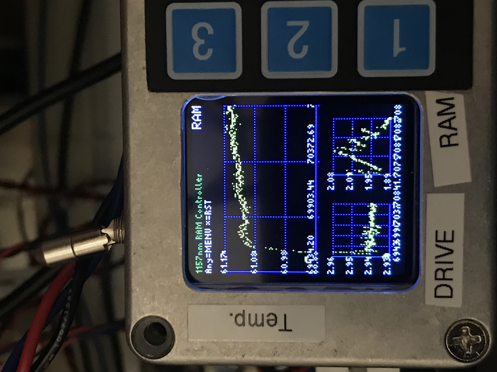

# yb-boy
Code for running the YbBoy. A small lab interfacing tool.

For information on this project and documentation check the [wiki](https://github.com/collegefishies/yb-boy/wiki)!

# Intended Usage

This device was intended to serve as temperature and RAM compensation box for our sensitive clock apparatus. It works on 3.3V Analog "Logic". You need to add shifters and circuits to make it drive other systems or voltage ranges.

## Temperature Lock Mode
The temperature lock runs by default, and will automatically switch to temperature lock mode if the RAM lock for some reason strays too far from the temperature set point. That deviation is defined in the code, and I believe it is something like 5 degrees celsius?

For us this was necessary to keep the EOM in the ballpark of the stable region whenever we didn't have the clock laser on, and hence no error signal for our RAM Lock.

If you want to just temperature control an object, you can use just the default mode and never attempt to run the RAM lock mode.

The parameters can be found in the "temperatureController.h" file.

## RAM Lock Mode
When the RAM error signal is fed into the Yb-Boy one can also then just reuse the TemperatureLock mode logic, and just change the error signal input. That's what's done.

It needs to only be activated in the "Settings" Menu. If the RAM lock falls out of lock for whatever reason there is a safety trigger that will fall back to temperature control mode when the temperature deviates too much.

I believe that part of the code is stored in "eomController.h".

## SWITCHPIN
For either stability concerns, or for upgrading the Yb-Boy, perhaps it is undesireable to ramp down the system you are controlling, the SWITCHPIN feature turns off all the locks, and so lets some other system control the temperature of your system.

You need to focus on the wiring management of this mode.
